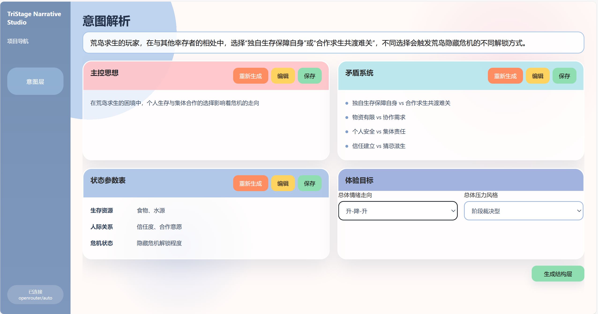
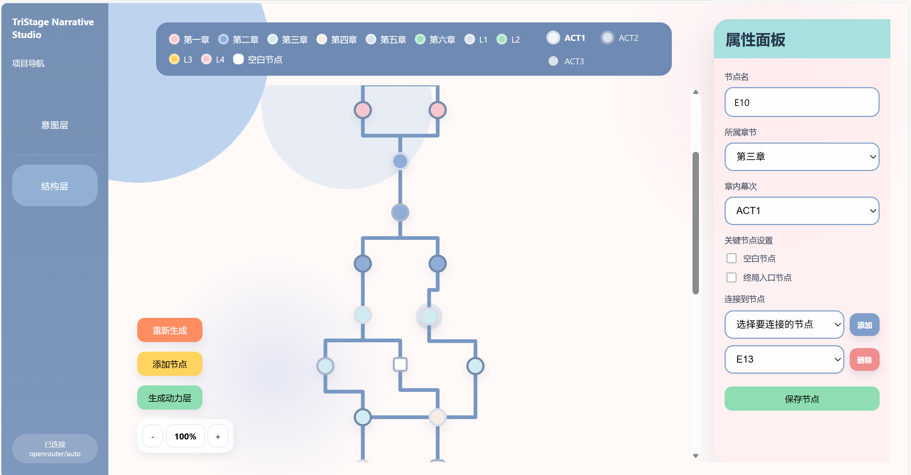
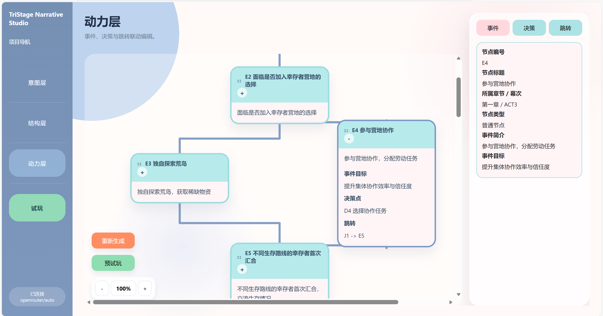
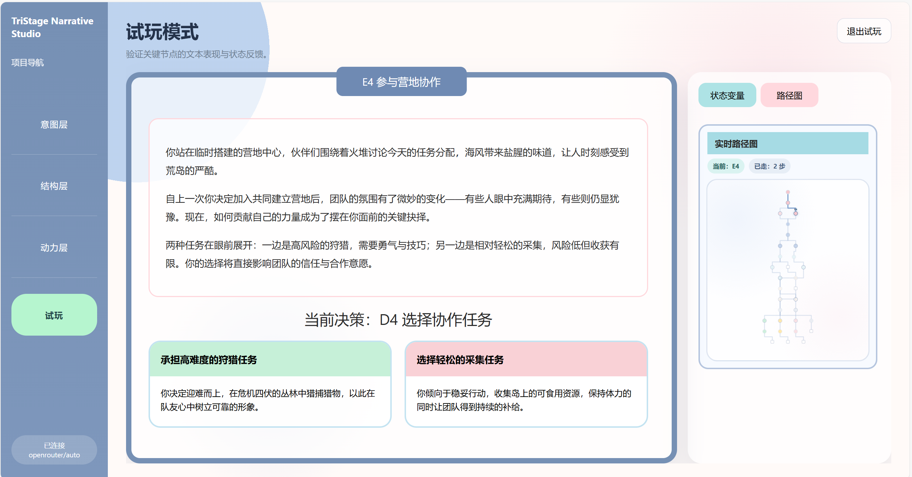

# TriStage Narrative Studio

一个基于你提供的设计图实现的可运行交互网页，包含：

- 起始生成页
- 意图层
- 结构层
- 动力层
- 试玩页
- OpenRouter `openai/gpt-5.4` 接口接入

## 启动

1. 复制环境变量模板并填入 OpenRouter Key
2. 运行 `npm start`
3. 打开 `http://localhost:3000`

## 环境变量

- `OPENROUTER_API_KEY`: OpenRouter API Key
- `OPENROUTER_MODEL`: 默认 `openai/gpt-5.4`
- `APP_PORT`: 默认 `3000`

未配置 Key 时，系统会使用本地回退示例数据，页面仍可完整交互。
## 界面预览

### 1. 起始生成页

用于输入一句话故事设想，系统将基于该输入生成后续的意图层、结构层、动力层与试玩内容。

### 2. 意图层

意图层用于整理故事的主控思想、矛盾系统、状态参数与体验目标，帮助用户先明确叙事方向，再进入后续结构生成。

### 3. 结构层

结构层以可视化拓扑图的方式展示章节、节点、终局线与空白节点关系，支持节点属性调整与连接编辑。

### 4. 动力层

动力层围绕事件、决策与跳转展开，对节点内部运行逻辑进行补全，支持查看与编辑事件摘要、决策点和跳转关系。

### 5. 试玩模式

试玩模式用于验证关键节点的文本表现、玩家选择、状态变量变化与路径推进效果，帮助快速检查叙事逻辑是否成立。

